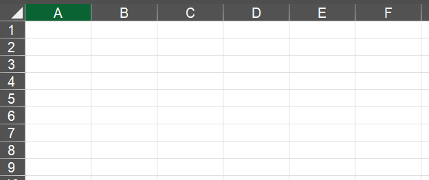
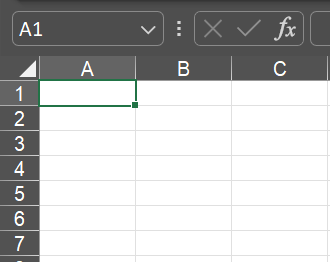
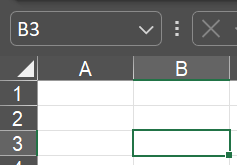
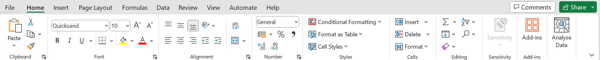

# Introduction

## 1.1 Definition of Spreadsheets

A spreadsheet is a grid-based tool used for organizing, analyzing, and presenting data. 

It consists of rows and columns, forming individual cells where data can be entered. 

Spreadsheets are widely used for various tasks, including budgeting, data analysis, and project management.

## 1.2 Common Uses of Spreadsheets

Spreadsheets are versatile and commonly used for tasks such as:

- Budgeting and Financial Tracking
- Data Analysis and Visualization
- Project Planning and Management
- Inventory Tracking
- Gradebooks and Attendance Sheets

## 1.3 Spreadsheet Software

Popular spreadsheet software includes Microsoft Excel, Google Sheets, and others. For this guide, we will use Microsoft Excel as an example.

## 1.4 Navigating the Spreadsheet Interface

**Rows and Columns**: Rows are horizontal, and columns are vertical. They are labeled with numbers (rows) and letters (columns).

**Cell**: The intersection of a row and a column is called a cell. Each cell has a unique address, such as A1 or B3.

**Worksheet Tabs**: In Excel, you can have multiple sheets within a workbook. Tabs at the bottom allow you to switch between different sheets.

**Ribbon**: The ribbon is a toolbar at the top of the Excel window, providing access to various commands and functions.

**Formula Bar**: Displays the content of the active cell and allows you to edit the cell's content.

## 1.5 Before we begin

Click and download the file below. This self-guide will be based of this file.

[Spreadsheet Basics File](Spreadsheet Basics Activity.xlsx){:download=Spreadsheet_Basics_Tutorial}

