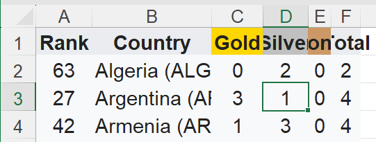
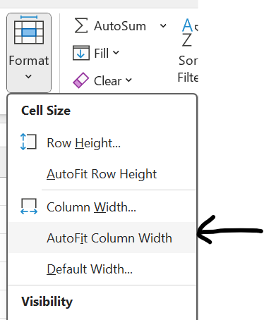
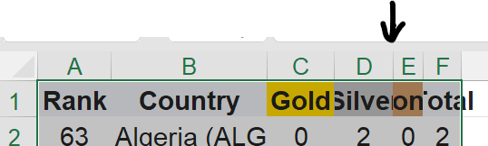

# Task 1 - Autofit

In the Spreadsheet document, some data may not be fully displayed and some numbers appear as hashtags (##).

We can solve this by extending the column width by using **Autofit**. 

## Method 1

- *Click* any cell in the table.

    

- *Press* the shortcut.
    

- Then click **Format** (Under home tab) and *select* **Autofit Columns Width**.

    

## Method 2

- *Double click* in between columns. 

    

- This will auto resize the column width to fit the cell values.