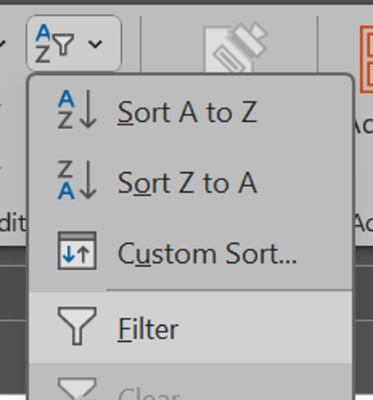
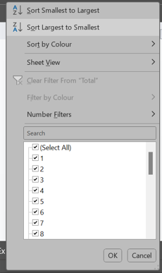

# Task 2 - Sorting and Filtering

## Step 1 - Adding the filter

- Click any data in the cell of the table.

- Press the shortcut.
    

- Go to **Home** tab.

- Then, **Editing** section and click 

    

- Select **Filter**.

## Step 2 - Sorting the data

- The header of the table should have a dropdown menu button that look like this. 

- Click it to display options to sort your data.

    

- Try sorting the data by Rank from smallest to largest and vice versa.