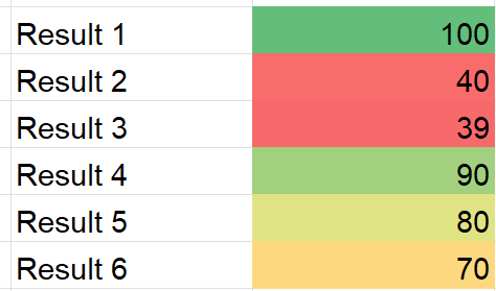
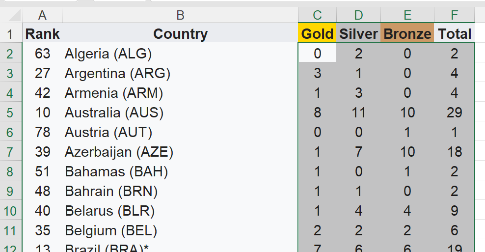
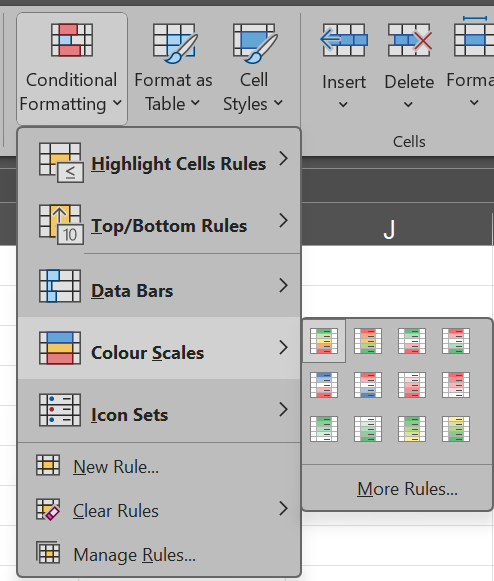
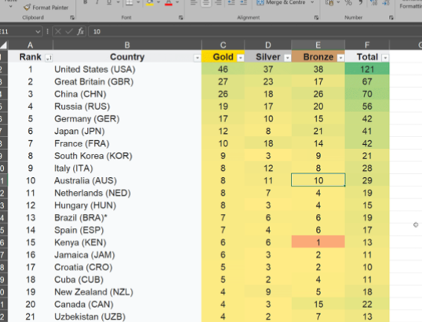

# Task 3 - Conditional Formatting

- At times we want the numerical data to visualised certain rank of numbers.

- We can do so by using conditional formatting

    

## Applying conditional formatting

- In the same sheet, click and select all the numerical values from **Gold**, **Silver**, **Bronze** and **Total**.
    
    
     

- Under **Home** tab, click **Conditional Formatting**.
- Then **Colour Scales** and select any of your preferred scales.
    

     

- Your result should look something like this.
    