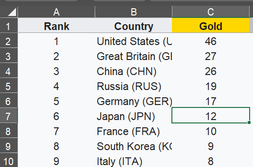
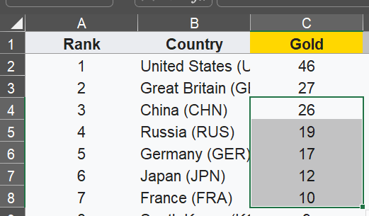
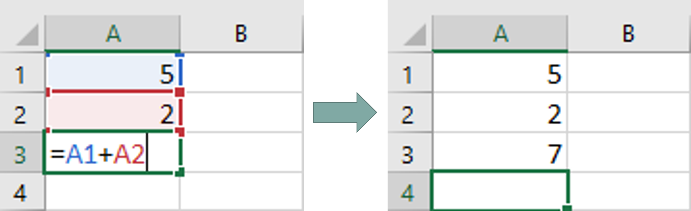
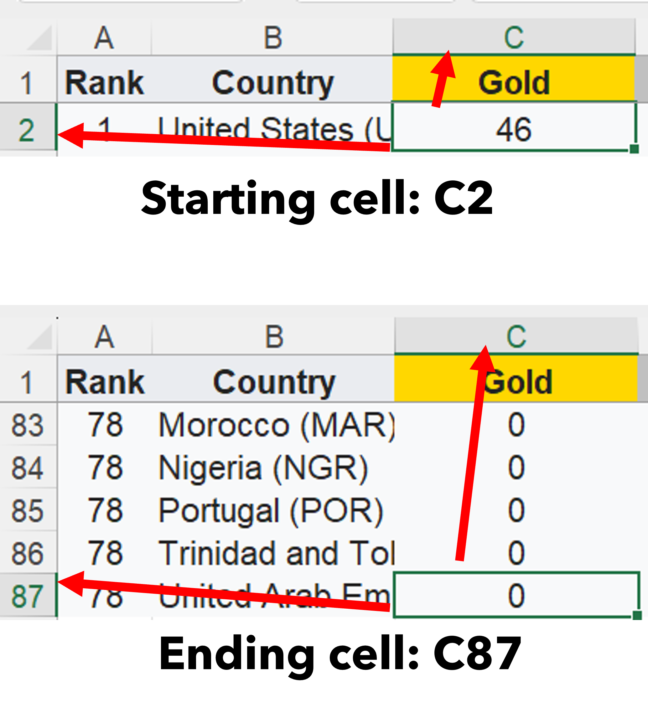
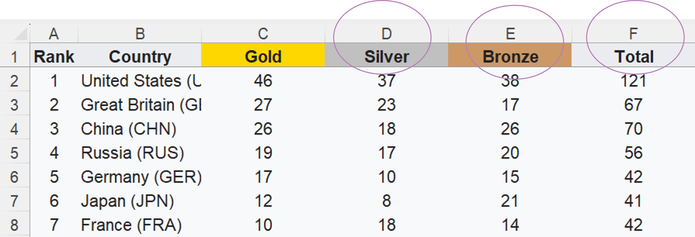

# Task 4 - Data Analysis

Before we begin, switch to the sheet named, **Analysing the data**.

 

## Identifying a Cell
Each cell has a location. 
Usually, can be referenced starting with the **column** letters and **row** number.
In the example below, the selected cell is at **C7**.

 

## Identifying Cell Range
For cell ranges, we referenced the **starting cell** followed by a colon (**:**), then the **ending cell**.
In the example on the right, the selected cell range is **C4:C8**

 

## Cell Referencing

Cell referencing is when we get value from another cell with their cell number.
We will use cell referencing to perform data analysis functions.

## Determining the cell range

- In the sheet, **Analysing the Data**, we are going to write functions where we will need to reference the cell range. 

- Hence, we need to know the cell range for the Gold, Silver, Bronze and Total column.

- Let's first determine the cell range for the **Gold** category.

- We need to know the **starting** cell, then the **ending** cell.

    

- From the images above, we can determine that:
    - C2 is the starting cell
    - C87 is the ending cell

- So, to reference the **Gold** category, we will reference it as **C2:C87**.

- Can you tell what is the cell range for the Silver, Bronze and Total category?

    

  <form id="quizForm">
    <input type="radio" id="option1" name="options" value="option1">
    <label for="option1">
        Silver: D2:D87 
        Bronze: E2:E87 
        Total: F2:F87    
    </label> 

    <input type="radio" id="option2" name="options" value="option2">
    <label for="option1">
        Silver: D2:D87 
        Bronze: E2:E87 
        Total: F2:F87    
    </label> 

    <input type="button" value="Submit" onclick="checkAnswer()">
  </form>

 
 