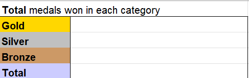
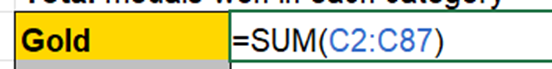

# Task 4.1 - SUM Function

Let’s say we want to know the total medals won in each category.

To do so, we can use the SUM function.

    =SUM(cells or cell range)

Let’s start by getting the total medals won in Gold category. As we now know the cell range for the Gold category (C3:C87) from the previous task. 

You may write the SUM function and reference the cell range. 

Once you have done that, do the same for the Silver, Bronze and Total category.

You may check your answer in the next Task.

