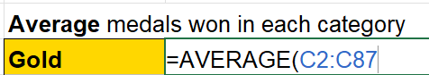

## Check previous task answer
Before beginning this task, check your answer from the previous task.

If it is correct, let's begin the average function.

 

# Task 4.2 - AVERAGE Function

AVERAGE function returns the average value of the selected cells.

You can write the function the same way as you have written for SUM function.

Just change the SUM to AVERAGE.

In the table below is the =AVERAGE(cell range) and reference the cells of the respective category.

Once you have done that, do the same for the Silver, Bronze and Total category.

You may check your answer in the next Task.

