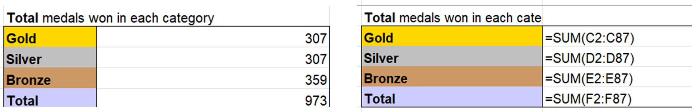
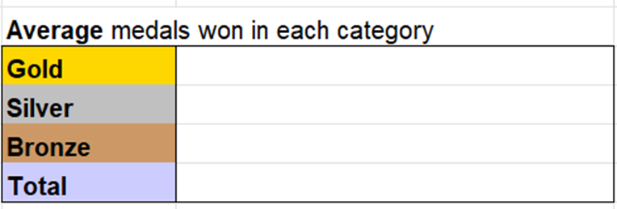

# Task 4.2 - AVERAGE Function

Before beginning this task, check your answer with this answer.

If it is correct, let's begin the average function.

AVERAGE function returns the average value of the selected cells.

You can write the function the same way as you have written for SUM function.

Just change the SUM to AVERAGE.

In the table below us the =AVERAGE(cell range) and reference the cells of the respective category.

