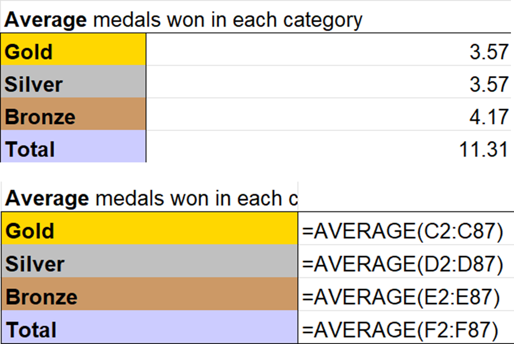
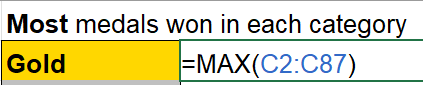
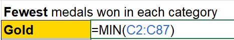

## Check previous task answer
Before beginning this task, check your answer from the previous task.

If it is correct, let's begin the MAX and MIN function.

 

# Task 4.3 - MAX and MIN

Max and Min function will return the maximum value or minimum value respectively from the selected range.

Try write =MAX(cell range) for the table to get the most medals.

Then write =MIN(cell range) to get the fewest medals.

Here is how you can use the MAX and MIN function for the Gold category.

Once you have done that, do the same for the Silver, Bronze and Total category.

You may check the answer in the next task.