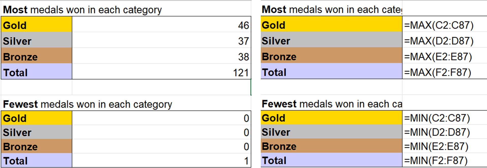
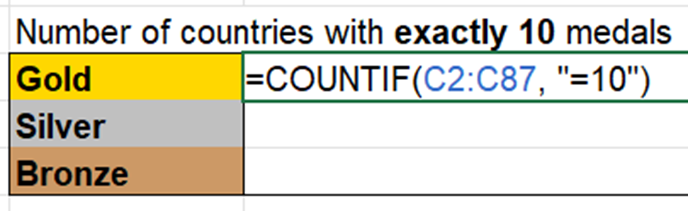
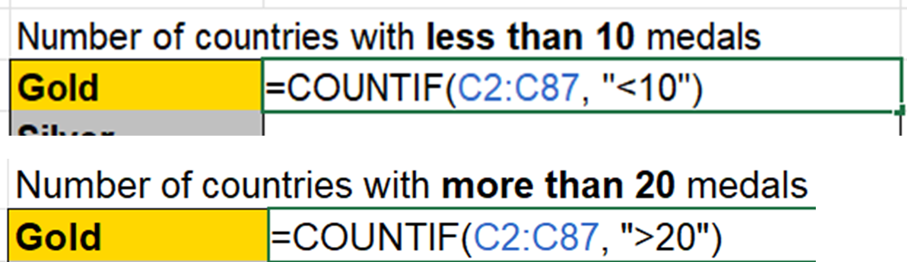

## Check previous task answer
Before beginning this task, check your answer from the previous task.

If it is correct, let's begin the COUNTIF function.

 

# Task 4.4 - COUNTIF

COUNTIF function will count the values based on a criteria.

CountIF function has two parameters; **range** & **criteria**.

**Parameters** in functions are separated by a comma ( , ).

| Criteria      |   Example |
| --------      |  ---------|
| equal (=)     | =10       |
| less than (<) | <10       |
| more than (>) | >10       |

In the example below, we use **=COUNTIF(C2:C87, "=10")**.

This means to count for values that is equal to 10 in the range of C2:C87 (cell range of Gold category).

Once you have done that, you can do COUNTIF for the silver, and bronze category.

After that, you can try changing the criteria to **less than** or **more than** criteria as shown below.

Then do the same for the silver and bronze category. Once completed, you may go to the next task to check your answers.