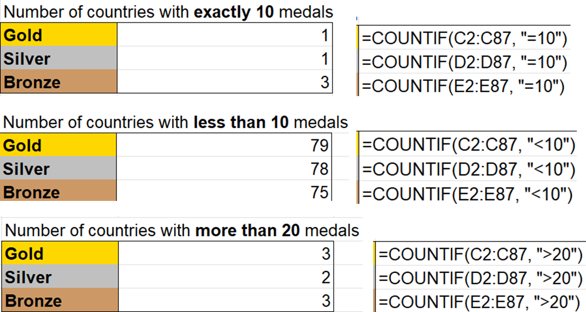
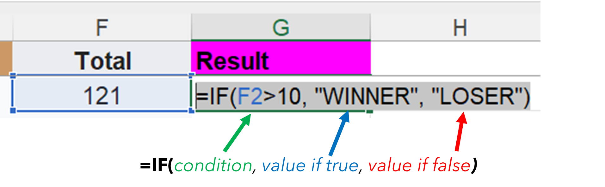
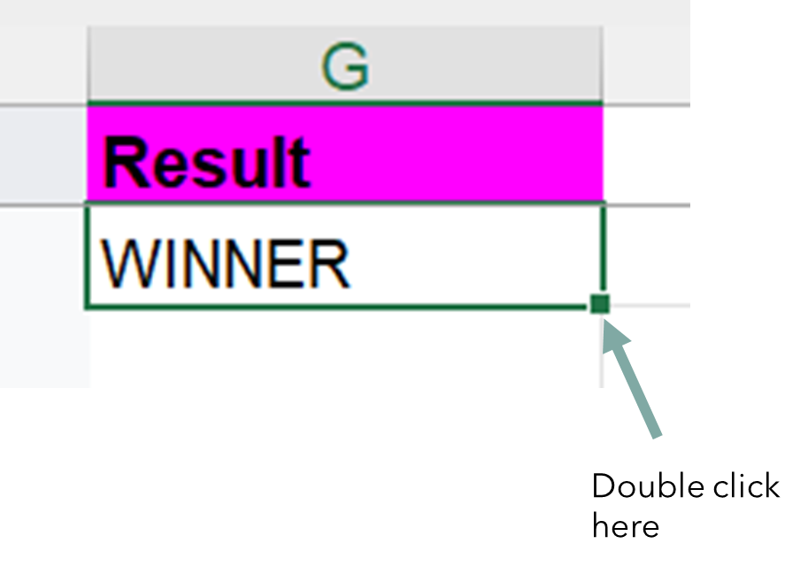
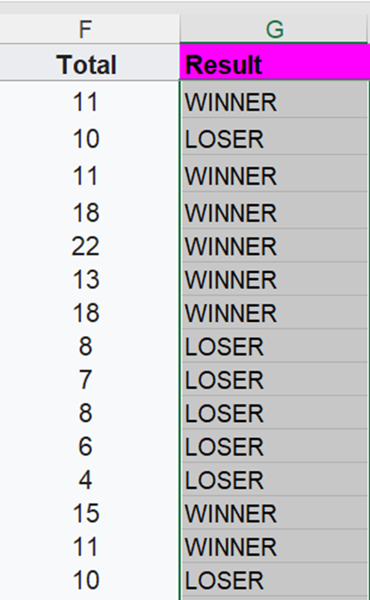

## Check previous task answer
Before beginning this task, check your answer from the previous task.

If it is correct, let's begin the IF function.

# Task 4.5 - IF

- The IF function has three parameters

- **Condition** is similar to criteria.
- **Value if true** parameter is the value to display if the condition is true.
- **Value if false** parameter is the value to display if the condition is false.

Try typing in the IF function in Cell G2 as shown below, then press enter. 

It should show the value "WINNER" as the value in Cell F2 is indeed more than 10.  

Let’s **autofill** the functions throughout the columns data.

Select the cell and double click the small green square at the bottom right of the cell.

This should autofill the rest of the cell with the same function.

You may scroll down to check the rest of the results.

The result value will be based on the value of the total column. 

That's all for basics function which may hopefully be useful in your workplace.

You may try out the Party Planning task.

