# Task 5 - Party Planning

Change the sheet to Party Planning

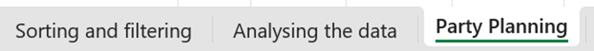

In this task, you will make a simple party planning sheet.

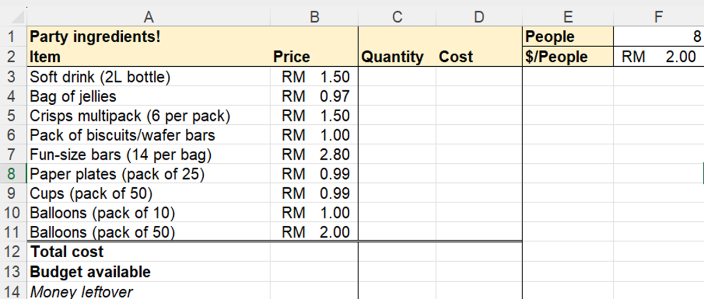

## Setting the cost formula

The cost formula would be the **Price times the Quantity**.
In spreadsheet, we use the asterisk symbol (*) for multiplication.

1. In Cell D3, write the formula to reference the cell **=B3*C3**.

    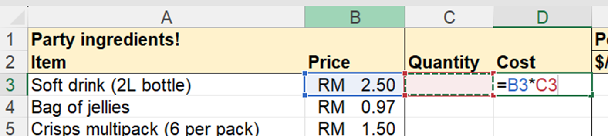

1. Press Enter, and your result should be 0.

    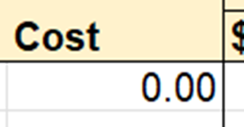

1. Try entering any number value in the quantity column in cell C3.

    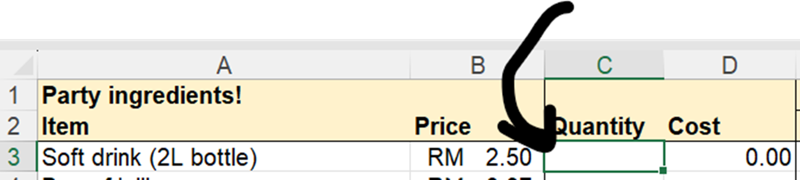

1. The cost value should auto-calculate.

    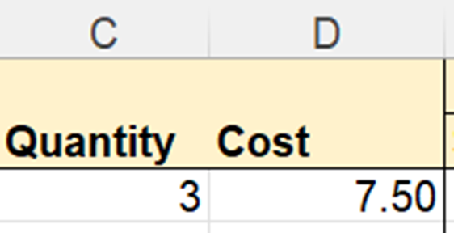

1.  Then, **autofill** the formula by clicking and dragging the bottom right green box until cell **D11**.

    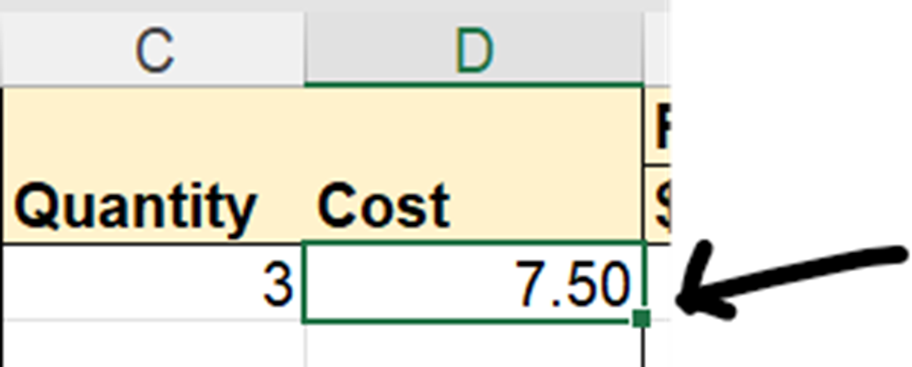

    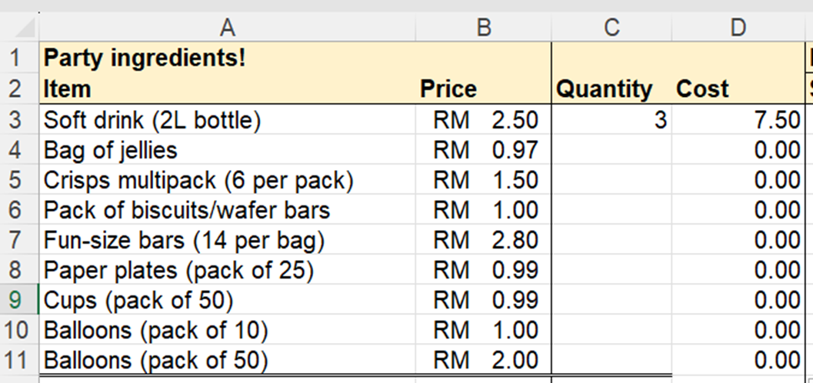

1. All the cost should be 0.
1. Try changing the quantity for each item as you like.

## Total Cost

Now to total up the cost.

1. In Cell D12, use the SUM function to sum up the cost for each item.
1. In Cell D13, write the formula =F1*F2
1. In Cell D14, write the formula =F13-F12

    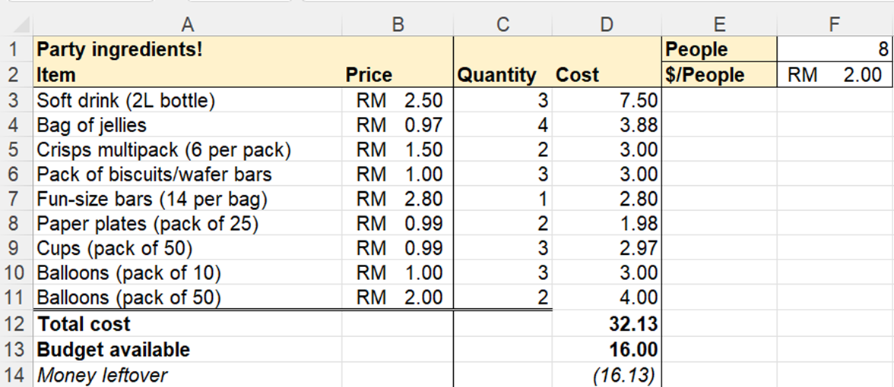

You should now have a party planning sheet.
Next is to convert the values to display currency.

## Displaying the currency

1. Select the cells containing values used for currency. 

    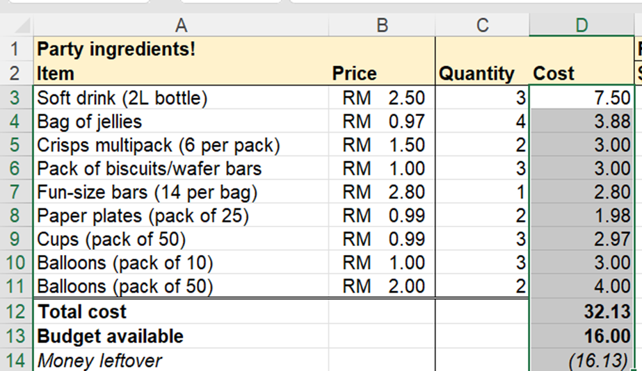

1. Then click the Currency symbol.

    

## Final result

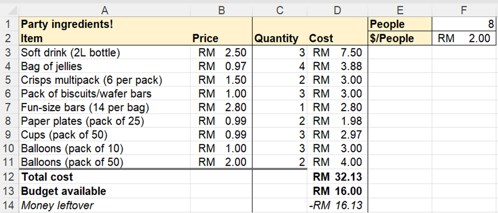

Feel free to adjust as you like.

Congratulations! This is the end of the basics spreadsheet guide.

I do apologise if there are any mistakes. Please do let me know, I'll fix them.
